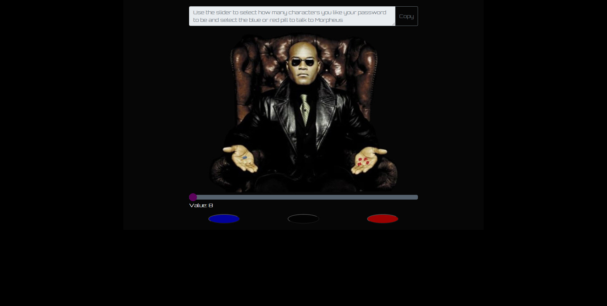
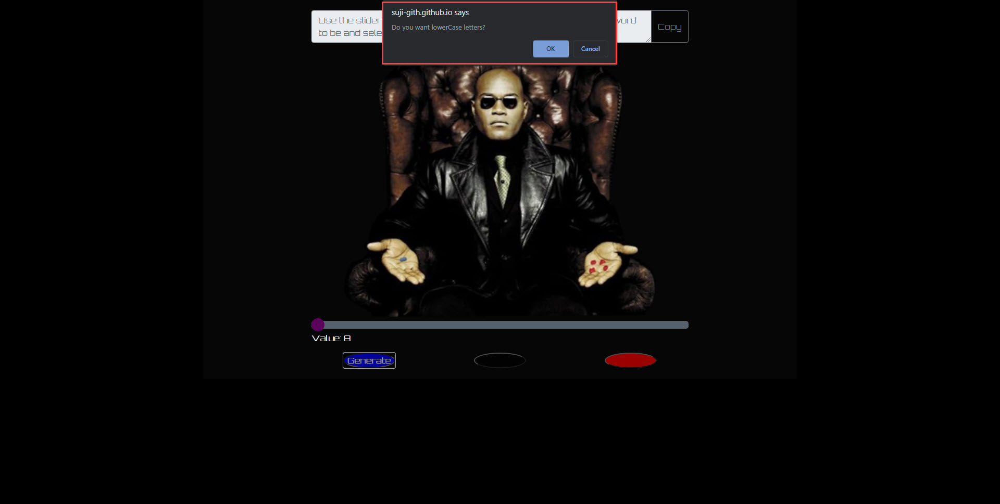
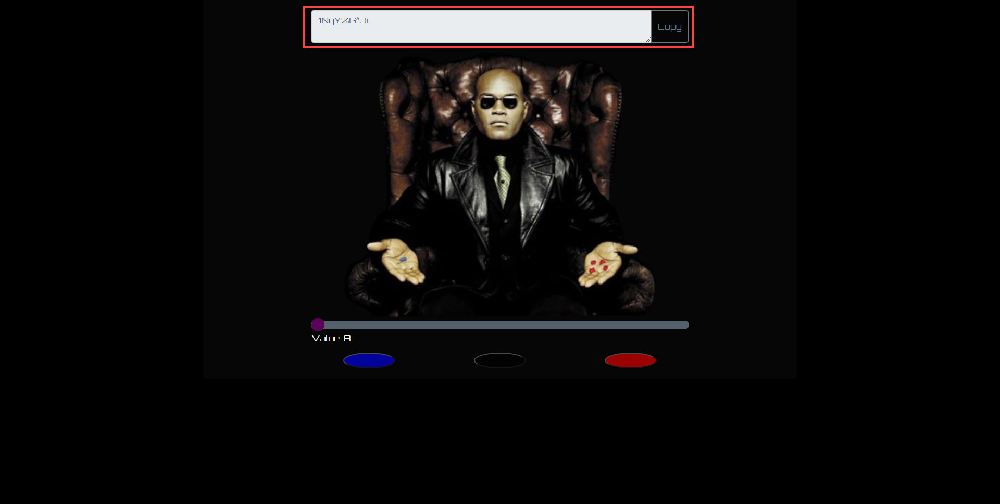
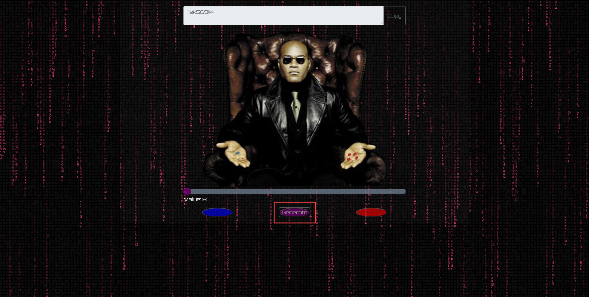

# Random Password Generator

## Application & Repository Link

###### [Application Link](https://suji-gith.github.io/MBC-PasswordGenerator/Rdm-PassGen.html)

###### [Repository Link](https://github.com/Suji-GitH/MBC-PasswordGenerator)

## Overview
AS AN employee with access to sensitive data
I WANT to randomly generate a password that meets certain criteria
SO THAT I can create a strong password that provides greater security

## Acceptance Criteria
GIVEN I need a new, secure password
WHEN I click the button to generate a password
THEN I am presented with a series of prompts for password criteria
WHEN prompted for password criteria
THEN I select which criteria to include in the password
WHEN prompted for the length of the password
THEN I choose a length of at least 8 characters and no more than 128 characters
WHEN prompted for character types to include in the password
THEN I choose lowercase, uppercase, numeric, and/or special characters
WHEN I answer each prompt
THEN my input should be validated and at least one character type should be selected
WHEN all prompts are answered
THEN a password is generated that matches the selected criteria
WHEN the password is generated
THEN the password is either displayed in an alert or written to the page

## Source and Folder Structure

<h3>Folder Structure</h3>
Parent Folder - Assignment 3
                    - ReadMe.md
                    - Rdm-PassGen.html
                    - assets
                        -CSS
                            -style.css
                        -img
                            -MorpheusChair.png
                            -Detectivefavicon.ico
                            -Screenshot
                                -LandingPage.jpg
                                -ConfirmPrompt.jpg
                                -PassGen.jpg
                                -PassGen-pBtn.jpg
                        -js
                            -script.js

## UI/UX Consideration
Overall theme for the Password Generated is inspired from Matrix.

The instruction for how the password is generated is written as placeholder in the TextArea. The TextArea will be read only so user cannot enter any text or delete the placeholder text. 

when user is hovering over the pills(buttons) "Generate" text is shown to just to emphasize user that it is used to generate Password. 

The middle button which is semi hidden coloured in black will change colour when hovered to purple with the same "Generate" text. Once the Password is Generated it will change the background with Matrix fallen character. 

## Application Screenshot
Landing Page

Confirm prompt

Password Generated 

Password generated when Middle button is clicked

## Pseudo Code
There is 3 major components needed to meet the Acceptance Criteria. 

<h3>Character length Slider</h3>

Slider value limited to minimum of 8 -  maximum of 128.

User is able to see the value when sliding side to side. 

Pass slider value when button is clicked.

<h3>Button Function</h3>

Clicking on the generate button initiates confirm function which:

    - Gets the  Password criteria from the user in the form of True or False
    - Generates String based of the user selected Password criteria
    - Grab random characters from string generated until it meets the character value set by the slider
    - Pass generated value to Text Area 

When middle button is clicked it will run the same code as other button + execution of background screen change. This code is taken from https://codepen.io/wefiy/pen/WPpEwo with changes to CSS to apply over current CSS. 

<h3>Generated Password TextArea</h3>

Set TextArea to be read only.

Clicking the copy button will execute copy command function to grab displayed text and alert the user to with the message. 

## Testing
FrontEnd Testing only conducted and for main functionality

When User is landed on the page, User is presented with textbox, Morpheus Image, Slider and three buttons. 

When page is loaded, TextArea contains Placeholder text with instruction.

When User moves the slider, the value for slider will increment by 1 and not go below 8 or above 128 and changes value according to the current spot.

When any of the button is clicked, User is prompted with series of true or false questions.

When Confirm Prompt is complete, User is able to see the generated password based on the true criteria and character limit set in the TextArea.  

When Purple button is complete, Background is changed to Matrix Background. 

When Copy button is clicked, Password generated in the text Area is copied and alert user with message, which includes the copied password. 

When Password is generated again, TextArea is replaced with then new generated Password.
